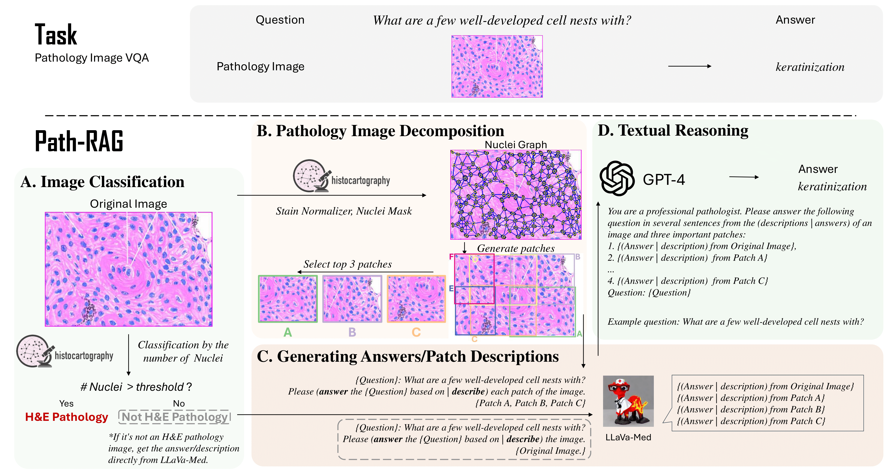

# Path-RAG: Knowledge-Guided Key Region Retrieval for Open-ended Pathology Visual Question Answering

<p align="center">
     <br>
 
  *Accurate diagnosis and prognosis assisted by pathology images are essential for cancer treatment selection and planning. Despite the recent trend of adopting deep-learning approaches for analyzing complex pathology images, they fall short as they often overlook the domain-expert understanding of tissue structure and cell composition. In this work, we focus on a challenging Open-ended Pathology VQA (PathVQA-Open) task and propose a novel framework named Path-RAG, which leverages HistoCartography to retrieve relevant domain knowledge from pathology images and significantly improves performance on PathVQA-Open. Admitting the complexity of pathology image analysis, Path-RAG adopts a human-centered AI approach by retrieving domain knowledge using HistoCartography to select the relevant patches from pathology images. Our experiments suggest that domain guidance can significantly boost the accuracy of LLaVA-Med from 38\% to 47\%, with a notable gain of 28\% for H\&E-stained pathology images in the PathVQA-Open dataset. For longer-form question and answer pairs, our model consistently achieves significant improvements of 32.5\% in ARCH-Open PubMed and 30.6\% in ARCH-Open Books on H\&E images.*
</p>

## Path-RAG Implementation

### 1. Clone this repository and navigate to path-rag folder

```Shell
git clone https://github.com/embedded-robotics/path-rag.git
cd path-rag
```

### 2. Install Package: Create conda environment

```Shell
conda create -n path-rag python=3.10 -y
conda activate path-rag
pip install --upgrade pip # enable PEP 660 support for LLaVA-Med
```

### 3. Install the dependent packages for LLaVA-Med and HistoCartography (compatible with both LLaVA-Med and HistoCartography)

```Shell
pip install -r requirements.txt
```

### 4. Download the PathVQA dataset from the following link

[PathVQA Dataset](https://github.com/UCSD-AI4H/PathVQA/blob/master/data/README.md)

### 5. Clone the HistoCartography tool and setup the model checkpoints in `histocartography/checkpoints`

```Shell
git clone https://github.com/BiomedSciAI/histocartography
```

### 6. Clone the LLaVA-Med repository

```Shell
git clone https://github.com/microsoft/LLaVA-Med
```

### 7. Download the LLaMA-7B model and weights from HuggingFace

```Shell
python llama_7B_model_weights.py # LLaMA-7B weights/model stored into $HF_HOME (By Default $HF_HOME = ~/.cache/huggingface)
```

### 8. Download LLaVA-Med delta weights `llava_med_in_text_60k_ckpt2_delta` and `pvqa-9epoch_delta` from `https://github.com/microsoft/LLaVA-Med#model-download`. Put them inside a folder named `model_delta_weights`

### 9. Apply the LLaVA-Med delta weights to base LLaMA-7B to come up with the final weights for LLaVA-Med

```Shell
cd LLaVA-Med
```

#### LLaVA-Med pre-trained on general biomedicine data

```Shell
!python3 -m llava.model.apply_delta \
    --base ~/.cache/huggingface/hub/models--huggyllama--llama-7b/snapshots/8416d3fefb0cb3ff5775a7b13c1692d10ff1aa16 \
    --target ../final_models/llava_med \
    --delta ../model_delta_weights/llava_med_in_text_60k_ckpt2_delta
```

#### LLaVA-Med fine-tuned on PathVQA

```Shell
!python -m llava.model.apply_delta \
    --base ~/.cache/huggingface/hub/models--huggyllama--llama-7b/snapshots/8416d3fefb0cb3ff5775a7b13c1692d10ff1aa16 \
    --target ../final_models/llava_med_pvqa \
    --delta ../model_delta_weights/pvqa-9epoch_delta
```

```Shell
cd ..
```

### 10. Generate the top patches for open-ended PathVQA images using HistoCartography

```Shell
python generate_histo_patches.py
```

### 11. Generate the files for query to be asked for LLaVA-Med for both the images and patches

```Shell
python generate_llava_med_query.py
```

### 12. Now we need to generate the answer for all the query files using raw model (`final_models/llava_med`) and fine-tuned model (`final_models/llava_med_pvqa`)

```Shell
cd LLaVA-Med
```

#### Raw Model
```Shell
python llava/eval/model_vqa.py --model-name ../final_models/llava_med \
    --question-file ../files/query/image_direct.jsonl \
    --image-folder ../pvqa/images/test \
    --answers-file ../files/answer/raw/answer_image_direct.jsonl
```

```Shell
python llava/eval/model_vqa.py --model-name ../final_models/llava_med \
    --question-file ../files/query/patch_direct.jsonl \
    --image-folder ../pvqa/images/test \
    --answers-file ../files/answer/raw/answer_patch_direct.jsonl
```

```Shell
python llava/eval/model_vqa.py --model-name ../final_models/llava_med \
    --question-file ../files/query/image_description.jsonl \
    --image-folder ../pvqa/images/test \
    --answers-file ../files/answer/raw/answer_image_description.jsonl
```

```Shell
python llava/eval/model_vqa.py --model-name ../final_models/llava_med \
    --question-file ../files/query/patch_description.jsonl \
    --image-folder ../pvqa/images/test \
    --answers-file ../files/answer/raw/answer_patch_description.jsonl
```

#### Fine-Tuned Model
```Shell
python llava/eval/model_vqa.py --model-name ../final_models/llava_med_pvqa \
    --question-file ../files/query/image_direct.jsonl \
    --image-folder ../pvqa/images/test \
    --answers-file ../files/answer/fine-tuned/answer_image_direct.jsonl
```

```Shell
python llava/eval/model_vqa.py --model-name ../final_models/llava_med_pvqa \
    --question-file ../files/query/patch_direct.jsonl \
    --image-folder ../pvqa/images/test \
    --answers-file ../files/answer/fine-tuned/answer_patch_direct.jsonl
```

```Shell
python llava/eval/model_vqa.py --model-name ../final_models/llava_med_pvqa \
    --question-file ../files/query/image_description.jsonl \
    --image-folder ../pvqa/images/test \
    --answers-file ../files/answer/fine-tuned/answer_image_description.jsonl
```

```Shell
python llava/eval/model_vqa.py --model-name ../final_models/llava_med_pvqa \
    --question-file ../files/query/patch_description.jsonl \
    --image-folder ../pvqa/images/test \
    --answers-file ../files/answer/fine-tuned/answer_patch_description.jsonl
```

### 13. Evaluate the results for different use-cases using `recall_calculation.py`

(i) Path-RAG w/o GPT: Combine the answer of image + all patches to be the final predicted answer\
(ii) Path-RAG (description): Combine the description of image + all patches. Then involve GPT-4 for reasoning to ge the final predicted answer (See Supplementary Section for Prompts)\
(iii) Path-RAG (answer): Combine the answer of image + all patches. Then involve GPT-4 for reasoning to ge the final predicted answer (See Supplementary Section for Prompts)


## ARCH-Open Dataset

#### 1. Download the `books_set` and `pubmed_set` of ARCH dataset from  `https://warwick.ac.uk/fac/cross_fac/tia/data/arch`. Store both of these folders in a folder named `arch`

Both `books_set` and `pubmed_set` contains `captions.json` which lists a **caption** and a **UUID**, whereas **UUID** represents the file name in `images` folder and **caption** represents the description of the image.

#### 2. Using `captions.json` and `images` folder under `arch/books_set`, run the notebooks `ARCH-OPEN/books_data/synthetic_data_textbook.ipynb` by specifying the OpenAI credentials to generate the question-answer pairs for books set

#### 3. Using `captions.json` and `images` folder under `arch/pubmed_set`, run the notebooks `ARCH-OPEN/pubmed_data/synthetic_data_pubmed.ipynb` by specifying the OpenAI credentials to generate the question-answer pairs for pubmed set

#### 4. Run the notebook `ARCH-OPEN/synthetic_data_compilation.ipynb` to compile the `pubmed` and `books` question-answer pairs into json files namely `ARCH-OPEN/pubmed_qa_pairs.json` and `ARCH-OPEN/textbook_qa_pairs.json`. These files are already provided to be used directly

#### 5. The `*.json` files contain 5 question-pairs for each pair of `caption` and `uuid` (refers to image name in arch data `arch/pubmed_set/images`, `arch/books_set/images`) in the following format (for both `pubmed_set` and `books_set`):

```Shell
  {
    "figure_id": "00",
    "letter": "A",
    "caption": " A, Spindle cell variant of embryonal rhabdomyosarcoma is characterized by fascicles of eosinophilic spindle cells (B), some of which can show prominent paranuclear vacuolisation, as seen in leiomyosarcoma.",
    "uuid": "890e2e79-ab0a-4a2e-9d62-b0b6b3d43884",
    "Question_1": "What could be the general shape of cells in a spindle cell variant of embryonal rhabdomyosarcoma as seen in the image?",
    "Answer_1": "The cells often present with a spindle-like elongated shape.",
    "Question_2": "What type of structures could be visible in the image indicating the presence of spindle cells?",
    "Answer_2": "Fascicles, or bundles, of cells could be visible in the image, indicating the presence of spindle cells.",
    "Question_3": "Where in the cell would we likely find paranuclear vacuolisation in the image?",
    "Answer_3": "Paranuclear vacuolisation is usually seen around the nucleus area of the cell.",
    "Question_4": "What color might the spindle cells appear in the image?",
    "Answer_4": "The spindle cells may appear eosinophilic, or pinkish-red, under the microscope due to staining.",
    "Question_5": "What visual feature might differentiate spindle cells from leiomyosarcoma cells in the image?",
    "Answer_5": "Spindle cells might show prominent paranuclear vacuolisation, a feature that can differentiate them from leiomyosarcoma cells."
  }
```